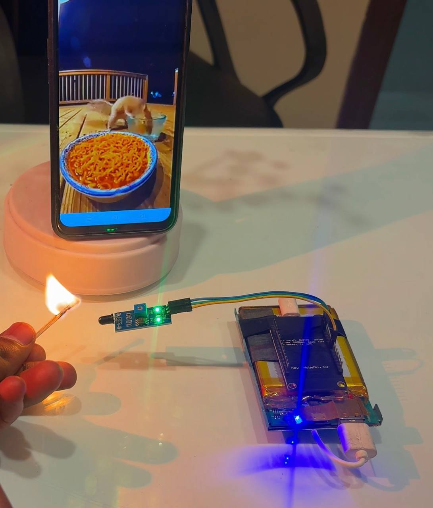

# 🔥 ESP8266 Fire Detection Video Alert System

An IoT-based fire detection system using an **ESP8266 NodeMCU** and **LM393 Flame Sensor**. When a flame is detected, the ESP8266 hosts a web page that automatically plays a preloaded video alert over WiFi.

---

## 📖 Overview

This project combines a flame sensor and ESP8266 to create a smart fire alert system.

### Features

- 🔥 Real-time flame detection
- 🌐 WiFi-based monitoring
- 🎥 Automatic video alert playback
- ⏱ 20-second detection hold to prevent flickering
- 📱 Works on phones, tablets, and PCs
- ⚡ Low-cost and easy to build
- 🔧 Fully customizable

---

## 📸 Project Preview

### Normal State

- Flame not detected
- Video paused
- System monitoring continuously

### Fire Detected

- Flame detected by LM393
- ESP8266 activates alert mode
- Video starts playing automatically
- Detection remains active for 20 seconds

---

## 🧰 Components Required

| Component | Quantity |
|------------|----------|
| ESP8266 NodeMCU | 1 |
| LM393 Flame Sensor Module | 1 |
| Breadboard | 1 |
| Jumper Wires | Few |
| USB Cable | 1 |
| WiFi Network | 1 |

---

## 🔌 Wiring Connections

| LM393 Flame Sensor | ESP8266 NodeMCU |
|--------------------|-----------------|
| VCC | 3.3V |
| GND | GND |
| DO | D5 (GPIO14) |

### Wiring Diagram

```text
LM393 Flame Sensor          ESP8266

VCC ---------------------> 3.3V

GND ---------------------> GND

DO ----------------------> D5 (GPIO14)
```

---

## ⚙️ Arduino IDE Setup

### Step 1: Install Arduino IDE

Download and install Arduino IDE.

### Step 2: Add ESP8266 Board Package

Open:

```text
File → Preferences
```

Add:

```text
http://arduino.esp8266.com/stable/package_esp8266com_index.json
```

to:

```text
Additional Boards Manager URLs
```

---

### Step 3: Install ESP8266 Package

Open:

```text
Tools → Board → Boards Manager
```

Search:

```text
ESP8266
```

Install:

```text
ESP8266 by ESP8266 Community
```

---

### Step 4: Select Board

```text
Tools → Board → NodeMCU 1.0 (ESP-12E Module)
```

---

## 📚 Required Libraries

Install through Library Manager:

```cpp
ESP8266WiFi
ESP8266WebServer
```

---

## 🚀 Uploading the Code

### Configure WiFi

Replace:

```cpp
const char* ssid = "YOUR_WIFI";
const char* password = "YOUR_PASSWORD";
```

with your WiFi credentials.

### Upload

1. Connect ESP8266
2. Select COM Port
3. Click Upload

---

## 📡 Getting the IP Address

Open Serial Monitor:

```text
115200 Baud
```

Example output:

```text
Connecting...
Connected!

IP Address:
192.168.1.50
```

Open browser:

```text
http://192.168.1.50
```

---

## 🧠 Working Principle

### System Flow

```text
Flame
  ↓
LM393 Sensor
  ↓
ESP8266 Reads Digital Output
  ↓
Fire Detected?
  ↓
YES
  ↓
Activate Alert Mode
  ↓
Play Video
  ↓
Keep Alert Active For 20 Seconds
  ↓
Return To Monitoring
```

---

## 🔄 Program Flow Chart

```text
+----------------+
|     Start      |
+----------------+
         |
         v
+----------------+
| Connect WiFi   |
+----------------+
         |
         v
+----------------+
| Read Sensor    |
+----------------+
         |
         v
+----------------+
| Fire Detected? |
+----------------+
     |      |
    No      Yes
     |        |
     v        v
 Continue   Play Video
Monitoring     |
               v
      Hold Active 20 sec
               |
               v
         Continue Loop
```

---

## 🎥 Video Alert

The project uses a Vimeo-hosted video as an alert.

Features:

- Preloaded in browser
- Automatic playback
- Loop enabled
- No page refresh
- Anti-flicker logic

---

## 🛠 Customization Ideas

You can easily extend this project with:

### Notifications

- Telegram Alerts
- Discord Webhooks
- Email Alerts
- Push Notifications

### Hardware

- Buzzer Alarm
- Relay Module
- Water Pump
- ESP32-CAM
- OLED Display

### Software

- MQTT Integration
- Home Assistant
- Blynk Dashboard
- Firebase Database
- 
---


## 📷 PICTURE

```markdown



---

## 🔮 Future Improvements

- ESP32-CAM Fire Snapshot
- Telegram Notification System
- SMS Alerts
- Automatic Fire Suppression Relay
- Cloud Monitoring Dashboard
- Mobile Application

---

## 🤝 Contributing

Contributions are welcome.

Feel free to:

- Open Issues
- Submit Pull Requests
- Suggest Improvements

---

## 📜 License

This project is licensed under the MIT License.

---

## ⭐ Support

If you found this project useful:

- ⭐ Star this repository
- 🍴 Fork it
- 📢 Share it with others

---

## 🏷️ Topics

```text
esp8266
nodemcu
arduino
iot
fire-detection
flame-sensor
lm393
wifi
webserver
embedded-systems
electronics
maker
automation
smart-home
```

---

## 👨‍💻 Author

Aaditya Maheshwari

Built with ❤️ using ESP8266 and Arduino.
